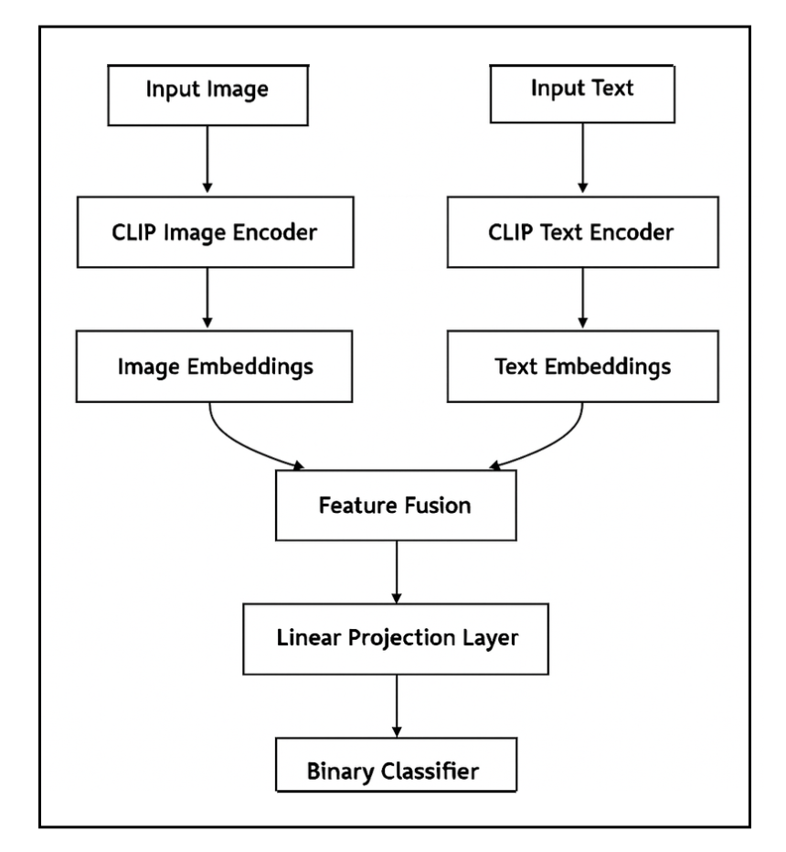

The overall CLIP based architecture implemented in this project is shown below. The experimentation will be done with different fusion strategies and pre-trained embeddings.

 

The first model implemented is clip-vit-base-patch32. It uses a Vision Transformer (ViT) with a patch size of 32x32 as its image encoder and a Transformer-based text encoder to generate multimodal embeddings. The features were simply concatenated (fusion strategy) and passed through linear layer. Initially, only the final linear layer was trained by freezing all CLIP parameters. The model was also trained without freezing any CLIP parameters. The accuracy and loss curve are shown in notebook inside folder clip-vit-base-patch32.
